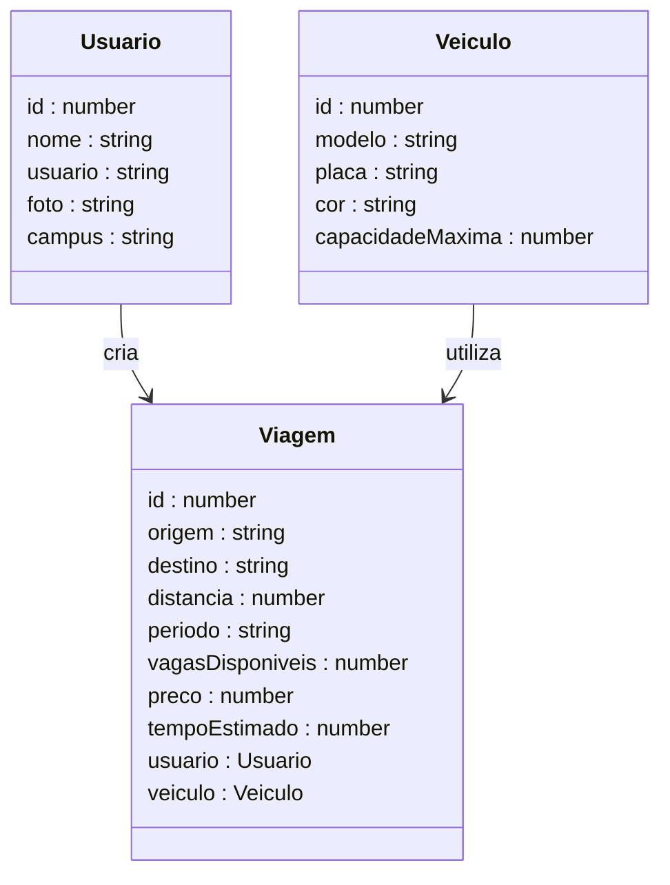

# Astra Corridas Compartilhadas - Frontend

<p align="center">
  <a href="https://astra-frontend-corridas.vercel.app/" target="blank"></a>
</p>

<div align="center">
  
  
  
  
  
  
</div>

---

## 1. Descrição

Interface web da plataforma **Astra Corridas Compartilhadas**, desenvolvida para oferecer uma experiência intuitiva e segura na busca e gerenciamento de caronas universitárias. O frontend consome a API REST do projeto backend e permite que os usuários interajam com as funcionalidades da plataforma de forma simples e fluida.

🔗 **Deploy:** [astra-frontend-corridas.vercel.app](https://astra-frontend-corridas.vercel.app/)

---

## 2. Funcionalidades

1. **Listagem de viagens** — visualização das viagens disponíveis com filtros por origem, destino e período
2. **Cadastro e edição de viagem** — formulário para criar e atualizar viagens, com cálculo automático de preço e tempo estimado pelo backend
3. **Listagem de veículos** — visualização dos veículos cadastrados na plataforma
4. **Cadastro e edição de veículo** — registro e atualização de veículos disponíveis para as viagens

---

## 3. Capturas de Tela

<div align="center">

<table>
  <tr>
    <td align="center" colspan="2"><b>Home</b></td>
  </tr>
  <tr>
    <td align="center" colspan="2"></td>
  </tr>
  <tr>
    <td align="center"><b>Viagens</b></td>
    <td align="center"><b>Veículos</b></td>
  </tr>
  <tr>
    <td></td>
    <td></td>
  </tr>
  <tr>
    <td align="center"><b>Cadastrar Viagem</b></td>
    <td align="center"><b>Cadastrar Veículo</b></td>
  </tr>
  <tr>
    <td></td>
    <td></td>
  </tr>
</table>

</div>

---

## 4. Diagrama de Classes (Models)

O diagrama abaixo representa as interfaces TypeScript utilizadas no frontend e seus relacionamentos.



---

## 5. Rotas da Aplicação

| Caminho | Página | Descrição |
|---------|--------|-----------|
| `/` | Home | Página inicial da plataforma |
| `/introducao` | Introdução | Contexto e problema que o Astra resolve |
| `/sobre` | Sobre | Informações sobre o projeto e a equipe |
| `/viagens` | Listagem de Viagens | Lista todas as viagens com filtros |
| `/viagens/form` | Cadastrar Viagem | Formulário de nova viagem |
| `/viagens/form/:id` | Editar Viagem | Formulário de edição de viagem existente |
| `/veiculos` | Listagem de Veículos | Lista todos os veículos cadastrados |
| `/veiculos/form` | Cadastrar Veículo | Formulário de novo veículo |
| `/veiculos/form/:id` | Editar Veículo | Formulário de edição de veículo existente |

---

## 6. Tecnologias

| Item | Descrição |
|------|-----------|
| **Linguagem** | TypeScript |
| **Biblioteca** | React JS |
| **Build** | Vite |
| **Estilização** | Tailwind CSS v4 |
| **Roteamento** | React Router DOM |
| **Requisições HTTP** | Axios |
| **Ícones** | Phosphor Icons |
| **Deploy** | Vercel |

---

## 7. Arquitetura do Projeto

O projeto segue uma organização modular por responsabilidade, aplicando boas práticas de projetos React modernos:

- **Pages** → telas da aplicação, compostas por componentes
- **Components** → elementos reutilizáveis de interface (Navbar, Footer)
- **Services** → camada de comunicação com a API via Axios
- **Models** → interfaces TypeScript que espelham as entidades do backend

Essa separação facilita a manutenção, escalabilidade e reaproveitamento de código.

---

## 8. Estrutura de Pastas

```plaintext
src/
│
├── components/       # Componentes reutilizáveis (Navbar, Footer)
├── models/           # Interfaces TypeScript da aplicação
├── pages/            # Páginas da aplicação
│   ├── home/
│   ├── sobre/
│   ├── veiculos/
│   └── viagens/
├── services/         # Integração com a API (requisições HTTP)
├── theme.ts          # Tokens de design (cores, estilos)
└── App.tsx           # Componente principal e configuração de rotas
```

---

## 9. Integração com o Backend

Este frontend consome a API REST do projeto backend, que expõe os seguintes recursos principais:

| Recurso | Descrição |
|---------|-----------|
| `POST /usuarios/cadastrar` | Cadastro de usuários |
| `POST /usuarios/logar` | Autenticação de usuários |
| `GET /viagens` | Listagem de viagens |
| `POST /viagens/cadastrar` | Criação de viagem |
| `PUT /viagens` | Atualização de viagem |
| `DELETE /viagens/:id` | Exclusão de viagem |
| `GET /veiculos` | Listagem de veículos |
| `POST /veiculos` | Criação de veículo |
| `PUT /veiculos` | Atualização de veículo |
| `DELETE /veiculos/:id` | Exclusão de veículo |

🔗 [Repositório do Backend](https://github.com/grupo6-js13/corridacompartilhada_backend)

---

## 10. Boas Práticas Aplicadas

- Organização modular por responsabilidade
- Tipagem forte com TypeScript e interfaces bem definidas
- Separação entre lógica de negócio (services) e apresentação (components/pages)
- Sistema de design tokens centralizado em `theme.ts`
- Estrutura preparada para escalabilidade

---

## 11. Diferenciais Técnicos

✅ SPA desenvolvida com React JS e TypeScript  
✅ Integração completa com API REST NestJS  
✅ CRUD completo de Viagem e Veículo  
✅ Cálculo automático de preço e tempo estimado via backend  
✅ Estilização responsiva com Tailwind CSS v4  
✅ Sistema de design tokens para consistência visual entre componentes  
✅ Organização modular escalável  

---

## 12. Requisitos

Para executar o projeto localmente:

- Node.js 18+
- npm
- API NestJS em execução (ver backend)

---

## 13. Configuração e Execução

1. Clone este repositório:
   ```bash
   git clone https://github.com/grupo6-js13/astra-frontend-corridas
   cd astra-frontend-corridas
   ```

2. Instale as dependências:
   ```bash
   npm install
   ```

3. Configure a variável de ambiente com o endereço da API:
   ```env
   VITE_API_URL=http://localhost:4000
   ```

4. Execute o projeto:
   ```bash
   npm run dev
   ```

5. Acesse em: `http://localhost:5173`

> Para rodar com o backend local, clone e execute o [Repositório do Backend](https://github.com/grupo6-js13/corridacompartilhada_backend) seguindo as instruções do README correspondente.

---

## 14. Autores

**Orbyte — Onde ideias orbitam a tecnologia**

🔗 **GitHub:** https://github.com/grupo6-js13/  
🔗 **E-mail:** grupo6js13@gmail.com

Projeto desenvolvido para **aprendizado contínuo**, **demonstração técnica** e **portfólio profissional**.