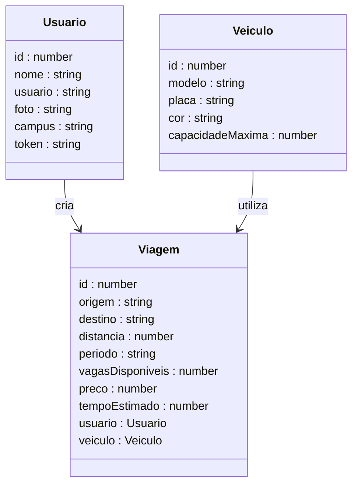
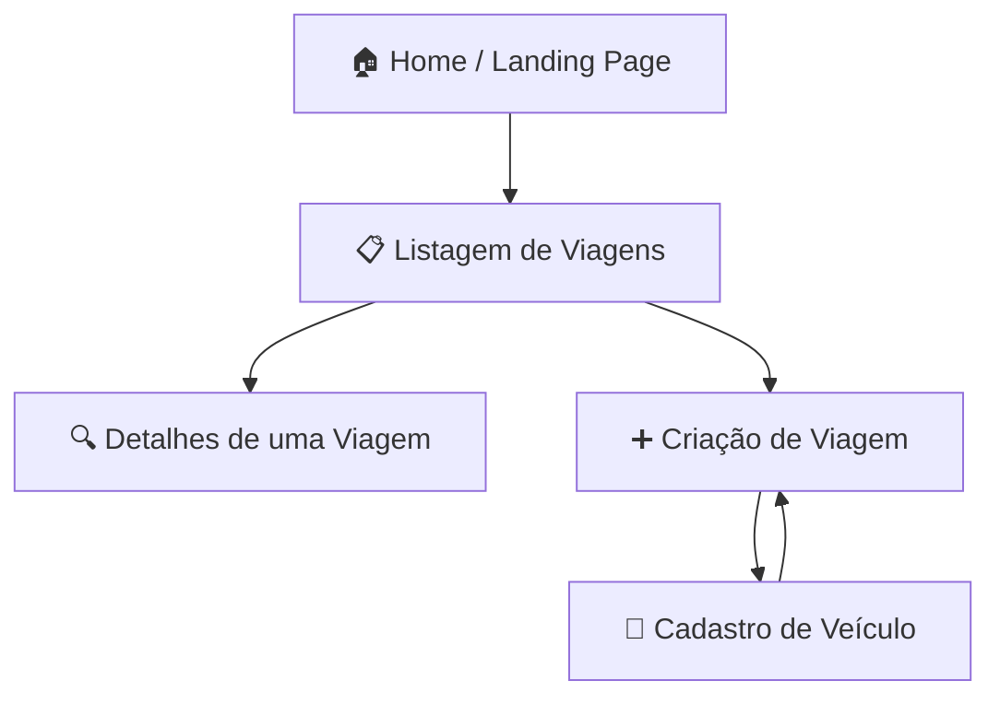

# Astra Corridas Compartilhadas - Frontend

<p align="center">
  <a href="https://vitejs.dev/" target="blank"></a>
</p>

<div align="center">
  
  
  
  
  
  
</div>

---

## 1. Descrição

Interface web da plataforma **Astra Corridas Compartilhadas**, desenvolvida para oferecer uma experiência intuitiva e segura na busca e gerenciamento de caronas universitárias. O frontend consome a API REST do projeto backend e permite que os usuários interajam com as funcionalidades da plataforma de forma simples e fluida.

---

## 2. Recursos

1. **Listagem e busca de viagens** — visualização das viagens disponíveis com filtros por origem, destino e período
2. **Detalhes de uma viagem** — exibição completa das informações de uma viagem, incluindo veículo e motorista
3. **Criação de viagem** — formulário para cadastrar novas viagens vinculadas ao usuário autenticado
4. **Cadastro de veículo** — registro de veículos para serem utilizados nas viagens

---

## 3. Protótipo e Capturas de Tela

> 🚧 Em breve — prints e protótipo serão adicionados conforme o desenvolvimento avança.

---

## 4. Diagrama de Classes (Models)

O diagrama abaixo representa as interfaces/models utilizados no frontend e seus relacionamentos.



---

## 5. Diagrama de Rotas e Navegação

O diagrama abaixo representa o fluxo de navegação entre as páginas da aplicação.



---

## 6. Tecnologias

| Item                         | Descrição  |
| ---------------------------- | ---------- |
| **Servidor**                 | Node JS    |
| **Linguagem de programação** | TypeScript |
| **Biblioteca**               | React JS   |
| **Build**                    | Vite       |
| **Framework de Estilização** | Tailwind   |

---

## 7. Arquitetura do Projeto

O projeto foi desenvolvido seguindo uma organização modular por responsabilidade, inspirada nas boas práticas de projetos React modernos:

- **Pages** → representam as telas da aplicação, compostas por componentes
- **Components** → elementos reutilizáveis de interface
- **Services** → camada de comunicação com a API via requisições HTTP
- **Contexts** → gerenciamento de estado global (ex: usuário autenticado)
- **Models** → interfaces TypeScript que espelham as entidades do backend

Essa separação facilita a manutenção, escalabilidade e reaproveitamento de código.

---

## 8. Estrutura de Pastas

```plaintext
src/
│
├── components/       # Componentes reutilizáveis
├── contexts/         # Gerenciamento de estado global (ex: autenticação)
├── models/           # Interfaces TypeScript da aplicação
├── pages/            # Páginas da aplicação
├── services/         # Integração com a API (requisições HTTP)
├── utils/            # Funções auxiliares (alerts)
└── App.tsx           # Componente principal da aplicação
```

---

## 09. Integração com o Backend

Este frontend consome a API REST do projeto backend, que expõe os seguintes recursos principais:

| Recurso    | Descrição                                      |
| ---------- | ---------------------------------------------- |
| `/usuario` | Cadastro e autenticação de usuários            |
| `/viagem`  | Criação, listagem e atualização de viagens     |
| `/veiculo` | Cadastro e seleção de veículos para as viagens |

🔗 [Repositório do Backend](https://github.com/grupo6-js13/corridacompartilhada_backend)

---

## 10. Boas Práticas Aplicadas

Durante o desenvolvimento foram aplicados conceitos utilizados em projetos reais:

- Organização modular por responsabilidade
- Tipagem forte com TypeScript e interfaces bem definidas
- Separação entre lógica de negócio (services) e apresentação (components/pages)
- Gerenciamento de estado global com Context API
- Estrutura preparada para escalabilidade

---

## 11. Diferenciais Técnicos

✅ Construção de SPA com React JS e TypeScript  
✅ Integração completa com API REST NestJS  
✅ Modelagem de interfaces espelhando entidades do backend  
✅ Estilização responsiva com Tailwind CSS  
✅ Organização modular escalável  
✅ Uso profissional de TypeScript no frontend  

---

## 12. Requisitos

Para executar o projeto localmente:

- Node.js 18+
- yarn
- API NestJS em execução

---

## 13. Configuração e Execução

1. Clone este repositório
2. Instale as dependências: `yarn`
3. Clone e execute o backend: [Repositório do Backend](https://github.com/grupo6-js13/corridacompartilhada_backend)
   - Siga as instruções de **Configuração e Execução** descritas no README do backend
4. Configure a variável de ambiente com o endereço da API:
   ```env
   VITE_API_URL=http://localhost:4000
   ```
5. Execute o projeto: `yarn dev`
6. A aplicação estará disponível em: `http://localhost:5173`

---

## 15. Autores

**Orbyte - Onde as ideias orbitam em torno de conhecimento e tecnologia**

🔗 **GitHub:** https://github.com/grupo6-js13/

🔗 **E-mail:** grupo6js13@gmail.com

Projeto desenvolvido para **aprendizado contínuo**, **demonstração técnica** e **portfólio profissional**.